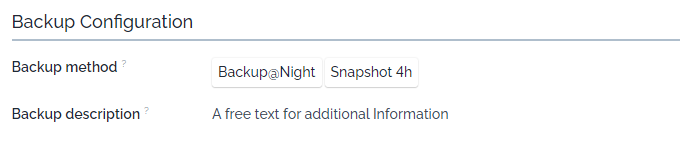
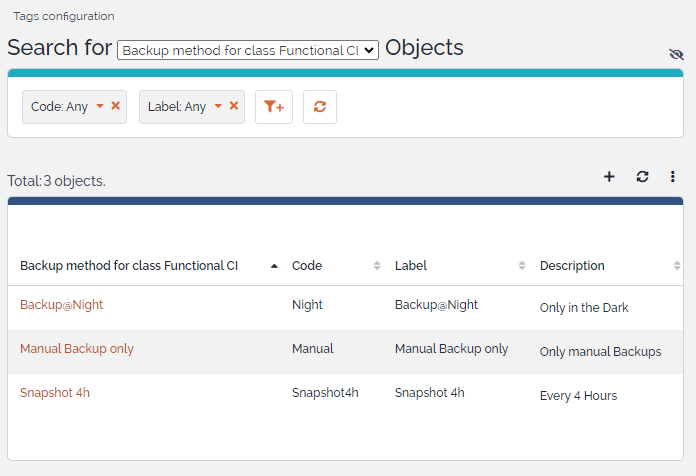

# iTop-br-backupconfiguration

Copyright (c) 2024 Björn Rudner

An iTop extension for structured configuration of backup processes for servers and applications, improving visibility and management of essential backup information.

---

## Overview

This extension adds fields and tagging options to the iTop configuration, making it easier to document and query backup settings on servers and applications. With these new options, you can efficiently manage backup configurations, ensuring that critical data about your backup methods and details are accessible and easy to monitor.

## Enhanced Classes

### FunctionalCI

This extension enhances the `FunctionalCI` class by introducing two new fields for backup management:

| Field Name            | Type              | Description                                                                                                            |
| --------------------- | ----------------- | ---------------------------------------------------------------------------------------------------------------------- |
| **backupmethod**      | `AttributeTagSet` | Defines the backup method with tags, allowing filtering by types such as full, incremental, differential, etc.         |
| **backupdescription** | `AttributeString` | Provides a field for additional details or instructions about the backup configuration for each server or application. |

For more information on using and querying tags, refer to the iTop documentation: [Tag Usage](https://www.itophub.io/wiki/page?id=2_7_0%3Afeature%3Atag).

### Tags Configuration

## Compatibility

This extension is compatible with the following iTop versions:

- **Branch [2.7](https://github.com/rudnerbjoern/iTop-br-backupconfiguration/tree/itop/2.7)**: Supports iTop 2.7 and 3.1.
- **Branch [main](https://github.com/rudnerbjoern/iTop-br-backupconfiguration/tree/main)**: Supports iTop 3.1 and above.

Tested iTop versions:

- 2.7.10
- 3.1.1 and 3.2.0-2

## Installation

1. Download or clone this repository.
2. Place the extension in the `extensions` folder of your iTop instance.
3. Run the iTop setup and enable the extension.

## Usage

Once installed, the extension allows backup configurations to be added directly within iTop for both servers and applications. You can:

- **Organize backups by method**: Use tags in the **backupmethod** field to categorize backup types for better filtering and management.
- **Document backup specifics**: Use the **backupdescription** field to capture relevant details or instructions about the backup process.

These configurations can then be queried and filtered based on assigned tags, improving overall backup management and monitoring.

## Contributors

Special thanks to our contributors:

- **[Uladzislau Vasilyeu](https://github.com/vasvlad)**

## License

This project is licensed under the GPL-3.0 License © 2022-2024 Björn Rudner. For details, refer to the [LICENSE](https://github.com/rudnerbjoern/iTop-br-backupconfiguration/blob/main/LICENSE) file.

---

This extension is ideal for organizations aiming to improve the documentation and management of backup processes for critical infrastructure within iTop.
